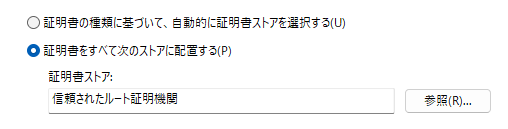

# cypas-local-tls-proxy

ローカルの開発環境の TLS 化をするプロキシです。

## なぜ必要か

Cypas のローカル開発環境では、\*.cypas.sec のドメイン名を使用しています。
このプロキシを起動すると、ローカル開発環境でドメイン名を名前解決し、HTTPS 通信ができるようになります。

## 初回にやること

### リポジトリをクローン

```
git clone https://github.com/shin-lab-sec/cypas-local-tls-proxy.git
```

### hosts ファイルに追記

PC 内部でドメイン名を名前解決できるようにします。
hosts ファイルを開き、以下の記述を付け足してください。
[この記事](https://complesso.jp/12624)が参考になります。

```
127.0.0.1 cypas.sec                     #http://localhost:8000
127.0.0.1 sms.cypas.sec                 #http://localhost:8001
127.0.0.1 cms.cypas.sec                 #http://localhost:8002
127.0.0.1 cms-storage.cypas.sec         #http://localhost:8003
127.0.0.1 useragent.cypas.sec           #https://internal-useragent.cypas.sec:8004
127.0.0.1 internal-useragent.cypas.sec
```

### 自己証明書の警告を消す

本来 SSL 証明書は有料で取得するものですが、開発用では自己証明書を使用しています。
自己証明書であるがゆえに、ブラウザが「この接続は保護されていません」のような警告を出されてしまいます。
そこで`conf/server.crt`をブラウザに信頼させてそれを消します。

chrome の場合

1. `chrome://settings/security`にブラウザでアクセス
2. 「デバイス証明書の管理」をクリック
3. 信頼されたルート証明機関をクリック
4. インポートをクリック
5. 次へをクリック
6. 参照をクリックして、本リポジトリの`conf/server.crt`を選択
7. 次へをクリック
8. 以下の表示を確認して次へをクリック

   

9. 完了をクリック

### .env ファイル作成

.env.example を参考に.env ファイルを作成してください。
開発環境の場合は、PC 自身のローカル IP アドレスで大丈夫です。

初回にやることは以上です。

## 2 回目以降

### プロキシ起動

```
docker compose up
```

### プロキシ削除

```
docker compose down
```
